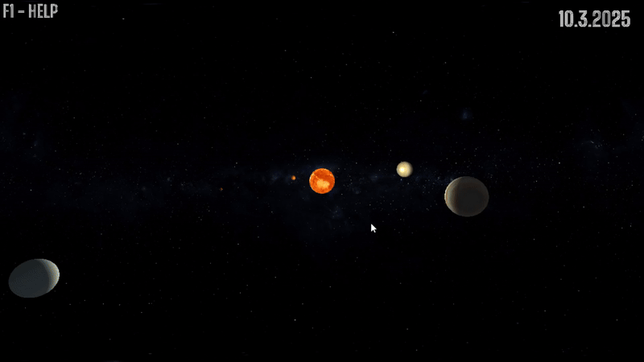

# Solar System Simulator

This is a **Solar System Simulator** app created using **OpenGL** as part of my college project for the **3D Computer Graphics** subject. The app simulates the positions of planets in the solar system and allows users to interact by changing the date using the left and right arrow keys.

---

## Features

- Displays the positions of planets in the solar system, updating according to the current date
- Allows users to change the date using the left and right arrow keys
- Planetary motion is simulated assuming that planets move in perfect circular orbits around the Sun
- The sizes of the planets and their distances are not to scale, but have been adjusted to custom sizes for better visual clarity
- Provides the ability to focus on the point of view (POV) of each planet by pressing keys 1-9

---

## Table of Contents

- [Project Purpose](#project-purpose)
- [Quick Start](#quick-start)
- [Controls](#controls)
- [Directory Layout](#directory-layout)
- [Architecture & Methodology](#architecture--methodology)
- [Results](#results)
- [Known Limitations](#known-limitations)
- [Screenshots and Demo](#screenshots-and-demo)

## Project Purpose

I built this simulator for the **3D Computer Graphics** course at **MATHOS Osijek** to demonstrate how a small, well‑structured OpenGL project can visualise complex motion while staying performant on entry‑level hardware.

## Quick Start

1. Clone the repository
```bash
git clone https://github.com/z0lt4np4l1nk4s/SolarSystemSimulator
```

2. Run the compile command
```bash
cd SolarSystemSimulator
.\compile.bat
```

3. Run the simulation
```bash
.\out.exe
```

*Requires a C++17 compiler*

---

## Controls

- **Left Arrow Key**: Decrease the current date and move backward in time.
- **Right Arrow Key**: Increase the current date and move forward in time.
- **Auto-Move** feature: Press the **Spacebar** to start the planets moving automatically. Press **Spacebar** again to stop the auto-movement.
- **Scroll**: Zoom in/out
- **0 Key**: Reset the camera
- **1-9 Keys**: Switch to the point of view of the corresponding planet:
  - **1**: Focus on the Sun
  - **2**: Focus on Mercury
  - **3**: Focus on Venus
  - **4**: Focus on Earth
  - **5**: Focus on Mars
  - **6**: Focus on Jupiter
  - **7**: Focus on Saturn
  - **8**: Focus on Uranus
  - **9**: Focus on Neptune

*(The help overlay is rendered with a custom bitmap‑font text engine implemented in **`src/text_renderer.cpp`**.)*

---

## Directory Layout

```
.
├─ include/           # Public C++ headers for external and internal components (GLFW, GLAD, GLM, stb_image)
├─ lib/               # Precompiled third-party libraries and static dependencies
├─ resources/         # Non-code assets used at runtime
│  ├─ shaders/        # GLSL shader programs (planet rendering, text overlay, skybox)
│  ├─ textures/       # High-resolution JPEG planet textures and starfield skybox
│  └─ fonts/          # TrueType fonts for HUD (e.g. BigShouldersInline‑*.ttf)
├─ screenshots/       # Visual assets (GIFs, PNGs) used in README or presentation
├─ src/               # Application source files (main logic, rendering, input, simulation)
│  ├─ models/         # Scene primitives: planets, moons, lighting, mesh generators
│  └─ …               # Other modules like renderer, input manager, orbit simulation
├─ compile.bat        # One‑click build script for Windows users (calls CMake + MSVC)
├─ main.cpp           # Entry point of the application (initialises window, engine, loop)
```

Key third‑party libraries are **GLFW, GLAD, GLM** and **stb\_image** — all bundled under permissive licenses so the project builds out‑of‑the‑box without system‑wide installs.

---

## Architecture & Methodology

### Data Sources

- Orbital periods & radii: NASA Planetary Fact Sheet
- Textures: [Solar System Scope](https://www.solarsystemscope.com/textures/) *(CC‑BY‑4.0)*

### Core Components

| Module         | Responsibility                           | Key APIs                     |
| -------------- | ---------------------------------------- | ---------------------------- |
| `Simulation`   | Julian‑day clock, circular‑orbit math    | `<chrono>`, GLM              |
| `Renderer`     | VBO/VAO setup, shader management, skybox | OpenGL 3.3, GLAD             |
| `Input`        | GLFW callbacks → app commands            | GLFW                         |
| `TextRenderer` | Bitmap‑font rendering (HUD & help)       | FreeType (via stb\_truetype) |
| `Assets`       | Texture & shader loading                 | stb\_image, `<filesystem>`   |

---

## Known Limitations

- **Idealised orbits** – planets follow perfect circles in a single plane; eccentricity, inclination and axial tilt are ignored.
- **Not‑to‑scale sizing** – planetary diameters and inter‑planet distances are intentionally exaggerated/compressed to keep everything visible in one view.
- **Only one moon** – currently *only Earth’s Moon* is rendered; no other natural satellites, dwarf planets or asteroid belt (see roadmap).
- **Single light source** – simple Phong lighting without shadows, eclipses or atmospheric scattering.
- **Preset trajectories** – planets do not exert gravity on each other; they move along predefined paths.

## Screenshots and Demo

### App Screenshot
Here’s a screenshot of the app:


### Demo GIF
Check out a short demo showing the app in action:


