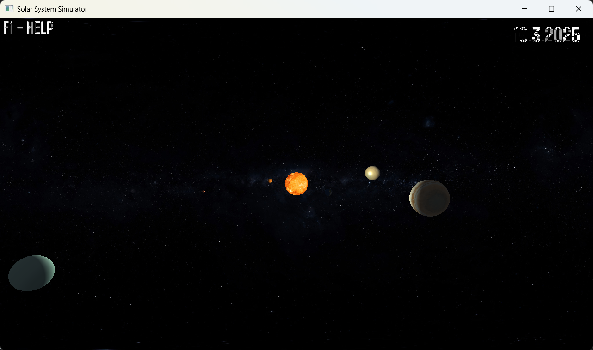

# Solar System Simulator

This is a **Solar System Simulator** app created using **OpenGL** as part of my college project for the **3D Computer Graphics** subject. The app simulates the positions of planets in the solar system and allows users to interact by changing the date using the left and right arrow keys.

## Features

- Displays the positions of planets in the solar system, updating according to the current date.
- Allows users to change the date using the left and right arrow keys.
- Planetary motion is simulated assuming that planets move in perfect circular orbits around the Sun.
- The sizes of the planets and their distances are not to scale, but have been adjusted to custom sizes for better visual clarity.
- Provides the ability to focus on the point of view (POV) of each planet by pressing keys 1-9

## Limitations

- The orbits of the planets are simplified to perfect circles, which is not completely accurate in real life.
- Planet sizes are not scaled to their actual dimensions, instead using custom sizes to make the simulation visually more appealing.

## Controls

- **Left Arrow Key**: Decrease the current date and move backward in time.
- **Right Arrow Key**: Increase the current date and move forward in time.
- **Auto-Move** feature: Press the **Spacebar** to start the planets moving automatically. Press **Spacebar** again to stop the auto-movement.
- **Scroll**: Zoom in/out
- **0 Key**: Reset the camera
- **1-9 Keys**: Switch to the point of view of the corresponding planet:
  - **1**: Focus on the Sun
  - **2**: Focus on Mercury
  - **3**: Focus on Venus
  - **4**: Focus on Earth
  - **5**: Focus on Mars
  - **6**: Focus on Jupiter
  - **7**: Focus on Saturn
  - **8**: Focus on Uranus
  - **9**: Focus on Neptune

## Screenshots and Demo

### App Screenshot
Here’s a screenshot of the app:

### Demo GIF
Check out a short demo showing the app in action:

